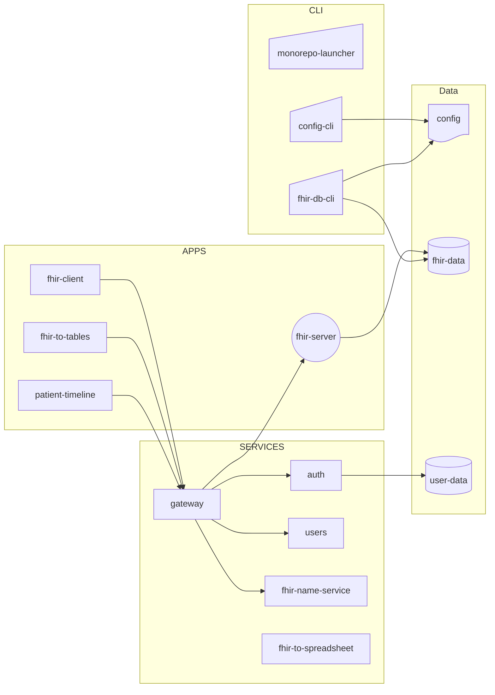

# Fhir Placeholder Api

## 🤔 What is this?

WIP

A collection of tools centered around Fhir R5 dummy data.

## Apps

- [fhir-client](apps/fhir-client)
- [fhir-data](apps/fhir-data)
- [fhir-server](apps/fhir-server)
- [fhir-to-tables](apps/fhir-to-tables)
- [patient-timeline](apps/patient-timeline)

## Cli

- [config-cli](cli/config-cli)
- [monorepo-launcher](cli/monorepo-launcher/)

## Services

- [auth](services/auth)
- [fhir-name-service](services/fhir-name-service)
- [fhir-to-spreadsheet](services/fhir-to-spreadsheet)
- [gateway](services/gateway)
- [users](services/users)

## App Interactions

## Packages

- [config-scripts](packages/config-scripts)
- [database-helpers](packages/database-helpers)
- [dummy-data](packages/dummy-data)
- [fhir-terminology](packages/fhir-terminology)
- [normalizer](packages/normalizer)
- [utils](packages/utils)
