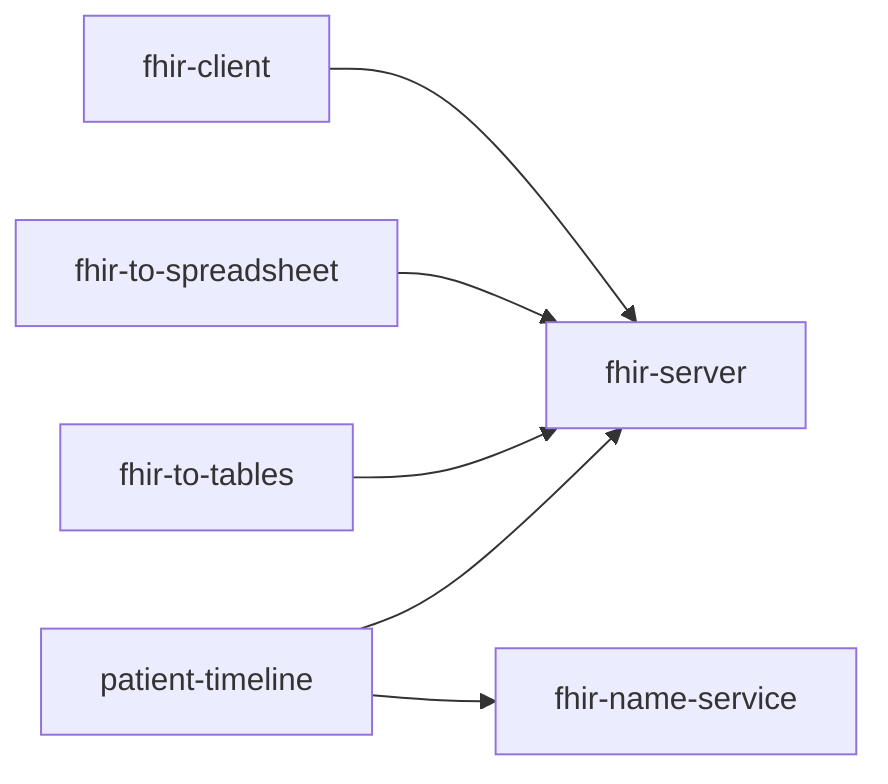

# Fhir Placeholder Api

## 🤔 What is this?

A collection of tools centered around Fhir R5 dummy data.

## Apps

- [fhir-client](apps/fhir-client)
- [fhir-name-service](apps/fhir-name-service)
- [fhir-server](apps/fhir-server)
- [fhir-to-spreadsheet](apps/fhir-to-spreadsheet)
- [fhir-to-tables](apps/fhir-to-tables)
- [patient-timeline](apps/patient-timeline)

## App interactions

## Packages

- [dummy-data](packages/dummy-data)
- [fhir-terminology](packages/fhir-terminology)
- [normalizer](packages/normalizer)
- [utils](packages/utils)
