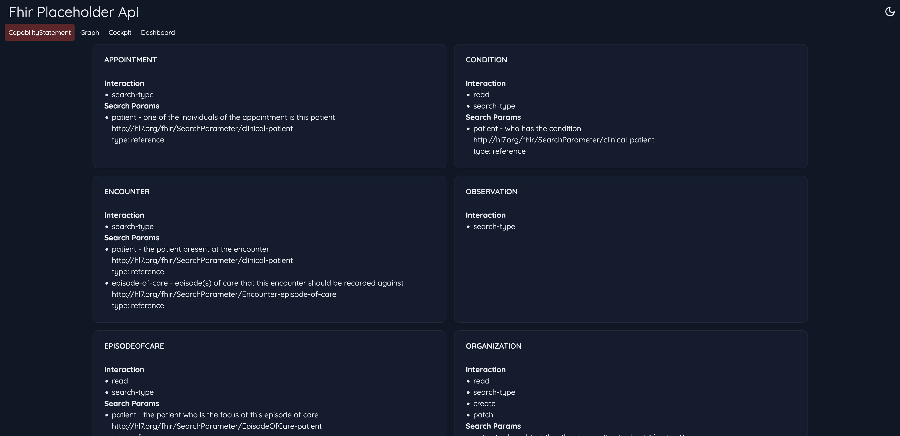
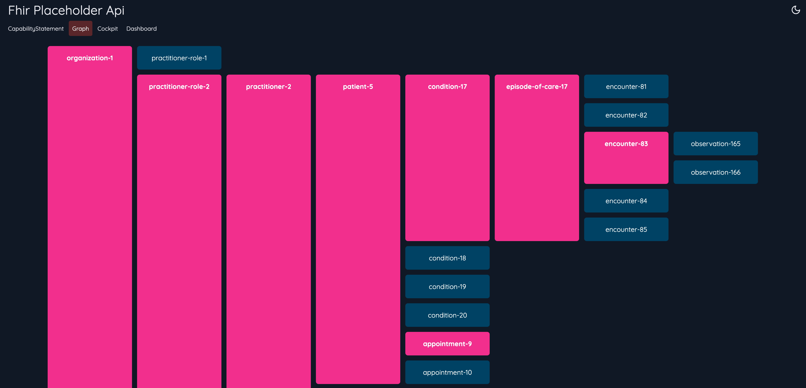
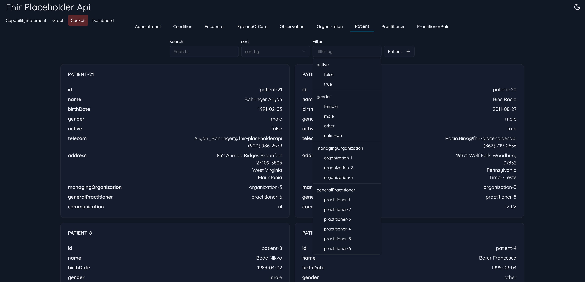
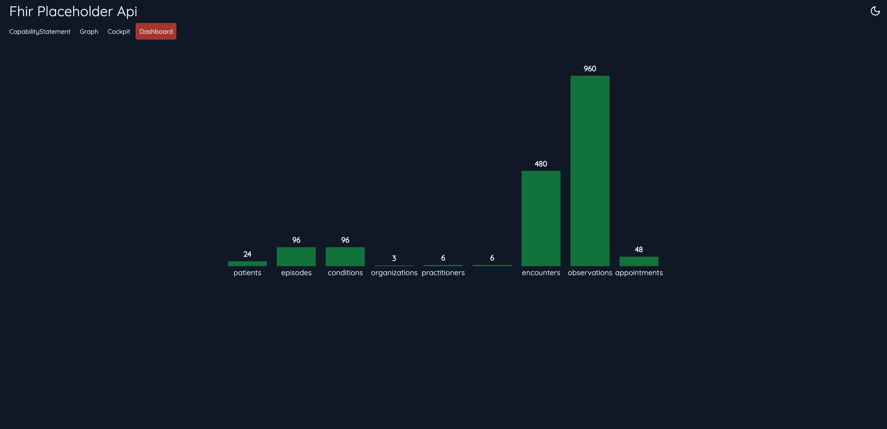

# README

## 🤔 What is this?

A simple server where you can get some dummy [fhir R5](https://hl7.org/fhir/R5/) resources.

You can run this server locally for development purposes. The data is in memory. On starting the server some dummy data is created. When shutting down the server all data is lost.

## :nerd_face: Technical

A server with NestJS

## :pray: Inspiration

Inspired by [{JSON} Placeholder](https://jsonplaceholder.typicode.com/)

## :telephone_receiver: Endpoints (wip)

- `GET /metadata`
- `GET /Patient`
- `GET /Patient?organization=<id>`
- `GET /Patient?general-practitioner=<id>`
- `GET /Patient/:id`
- `GET /EpisodeOfCare`
- `GET /EpisodeOfCare?patient=<id>`
- `GET /EpisodeOfCare?diagnosis-reference=<id>`
- `GET /EpisodeOfCare/:id`
- `GET /Condition`
- `GET /Condition?patient=<id>`
- `GET /Condition/:id`
- `GET /Practitioner`
- `GET /Practitioner/:id`
- `GET /PractitionerRole`
- `GET /Practitioner?practitioner=<id>`
- `GET /Practitioner?organization=<id>`
- `GET /Encounter`
- `GET /Encounter?patient=<id>`
- `GET /Encounter?episode-of-care=<id>`
- `GET /Observation`
- `GET /Observation?patient=<id>`
- `GET /Observation?encounter=<id>`
- `GET /Organization`
- `GET /Organization/:id`
- `POST /Organization`
- `PATCH /Organization/:id`

```typescript
fetch("http://localhost:8080/api/v2/r5/Patient/patient-3")
  .then((response) => response.json())
  .then((json) => console.log(json));
```

or

```sh
curl http://localhost:8080/api/v2/r5/Patient/patient-3
```

👇 _Output_

```json
{
  "id": "patient-3",
  "name": [
    {
      "family": "Anderson",
      "given": [
        "Leonel"
      ]
    }
  ],
  "resourceType": "Patient",
  "birthDate": "2010-12-11",
  "gender": "other",
  "active": false,
  "telecom": [
    {
      "use": "temp",
      "system": "email",
      "value": "Leonel.Anderson12@fhir-placeholder.api"
    },
    {
      "use": "work",
      "system": "phone",
      "value": "(935) 366-4757"
    }
  ],
  "address": [
    {
      "use": "old",
      "type": "both",
      "line": [
        "9901 Main Street E"
      ],
      "city": "Oak Park",
      "state": "Pennsylvania",
      "postalCode": "46259",
      "country": "Guadeloupe"
    }
  ],
  "managingOrganization": {
    "reference": "Organization/organization-1"
  },
  "generalPractitioner": [
    {
      "reference": "Practitioner/practitioner-1"
    }
  ],
  "communication": [
    {
      "language": {
        "coding": [
          {
            "code": "en-US",
            "system": "urn:ietf:bcp:47",
            "display": "English (United States)"
          }
        ]
      },
      "preferred": true
    }
  ]
}
```

## Tools (client)





